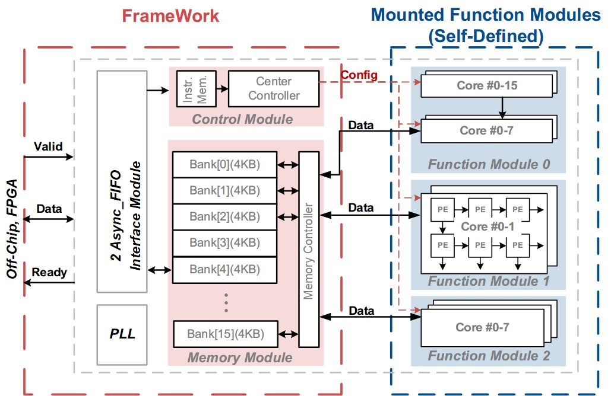

# 框架
- 自研Nebula“星云”硬件平台的整体硬件架构如图所示。
    - 图中左侧红色部分是“星云”硬件平台，提供片内外异步高速接口模块、负责指令译码的中央控制器和可配置高带宽可动态分配给功能模块的存储模块。
    - 右侧蓝色部分是3个功能模块/待测模块，可挂载在“星云”平台上。具体功能模块/待测模块可根据需要自行设计挂载，满足不同场景下的需求，具有可配置可扩展易使用的特点。

    - 
- “星云”硬件平台为所挂载的功能模块/待测模块提供大带宽的数据交互和高效的数据存储。
    - 接口模块Interface(ITF)采用两组高吞吐率(128bit，位宽可配置)的异步FIFO，负责连接外部低频时钟域sck和内部高速时钟域clk之间的数据传输。
    - 中央控制器模块Control Module(CCU)根据接收的指令，控制全局存储模块Global Memory Buffer (GLB)/Memory Module的控制器Global Buffer Interface Controller (GIC)，将GLB的数据通过ITF与外部数据进行传输。

# 目录
- hardware
    - src: 源码
        - TOP: 将整个工程封装成顶层
        - ITF: Interface模块，读写芯片外数据；含利用双向PAD提高利用率，异步FIFO满足芯片内部高频时钟域与芯片外部低频时钟域之间的数据传输，内部多个读写模块的仲裁
        - CCU: 中央控制器模块Control Module(CCU)负责接收指令，从而对各个模块分发指令和控制，同时承担对模块异常工作状态的检测、强制重置和停止的功能。
        - GLB: 通用的可为各个功能模块动态分配存储空间的存储模块
        - primitives: 模块库
            - Memory: 含对RAM的多种封装和例化（单口，双口，Register搭建，支持握手协议）；
            - FIFO: 多种FIFO，含First-word-Fall-Through即不需要读使能，自动将最新数据放在dout上；
            - SIPO, PISO, PACKER, BWC: 数据位宽转换(串并，任意位宽)；
            - SYNC：单bit/多bit的不同时钟域同步；
            - ARB：多种仲裁；
            - 其他：计数，延时，去抖，求和，求最大/最小，独热码，边沿检测，奇偶分频
    - vrf：验证/仿真脚本
        - run: csh 脚本，irun一行命令式，运行直接csh run
        - filelist.f：仿真所需文件列表
    - impl/synth: 综合和仿真功耗
        - run.csh: 综合csh脚本，set可配置多个选项，含时钟频率，group/ungroup，SDC位置，生成文件夹以日期为前缀；运行直接csh run.csh
        - run_power.csh: 仿真功耗脚本
    - fpga: FPGA对芯片进行测试的工程代码-通用测试平台Unified_Test_Platform(UTP)
        - 实现PC与芯片的双向数据流：PC的文本数据<->串口<->DDR<->AXI<->PL<->FPGA引脚<->芯片

# User guide
- 参考[教程](https://docs.github.com/cn/get-started/writing-on-github/getting-started-with-writing-and-formatting-on-github/basic-writing-and-formatting-syntax)，编辑readme.md。

- 参考这个[教程](https://developer.aliyun.com/article/604633)，把自己的修改提交到此源仓库的master分支。
！注意，只上传源文件如代码和脚本，不要上传生成文件和大文件(>1M)
  - 检查是否包含大于1M的文件的linux命令：find ./ -type f -size +1M -printf '%s %p\n' | sort -r
  - 提交的格式参考 [教程](https://www.cnblogs.com/daysme/p/7722474.html); 
    - 简化格式是<type是操作的类型>(<scope是操作的对象>): <subject是具体操作的描述> (例如feat(hardware/pool.v): add a arb_fifo module))
  

- verilog设计编程风格
  - **[Verilog代码命名六大黄金规则](https://mp.weixin.qq.com/s/oWlD29XnpDYwF3h5qvGI_Q)**
        - 模块名一律用三个大写字母，除通用模块
        - 内部信号用大驼峰：如WrVld, RdRdy
        - 端口信号用模块到模块_信号名，如CCUGLB_Vld
        - 参数用大写字母
        - 模块例化用U编号_模块名_功能，如U1_FIFO_CMD
  - module文件格式参考[template.v](hardware/src/primitives/template/template.v)
  - 整体参考[Verilog编程艺术](./hardware/docs/tutorial/0-Verilog编程艺术_compressed.pdf)
  - 备用参考
    - verilog项目参考[DnnWeaver开源AI加速器](https://github.com/zhouchch3/DNNWeaver/tree/master/hsharma35-dnnweaver.public/hsharma35-dnnweaver.public-6be20110b751/fpga/hardware/source)
    - 完整详细代码编写说明参考[Verilog/SystemVerilog 设计编码风格指南](https://verilogcodingstyle.readthedocs.io/en/latest/index.html)
- verilog模块库位于[primitives](/hardware/src/primitives)
- 硬件框图设计规范
    - 端口信号用紫色，位于模块框线上

